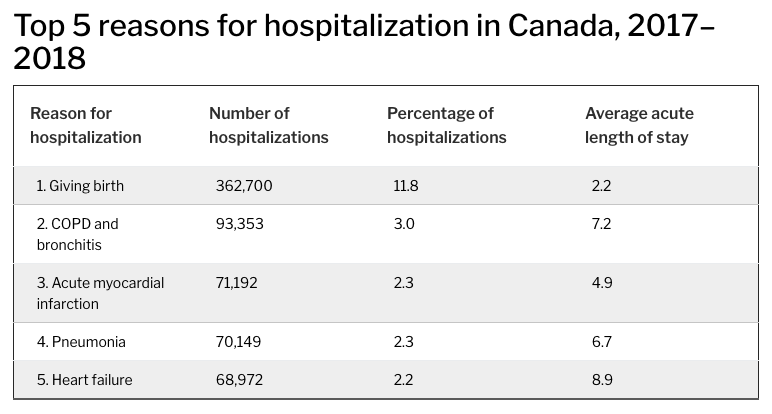
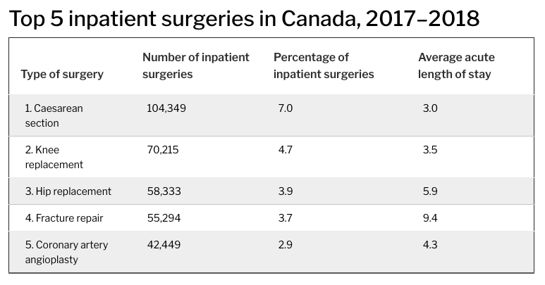
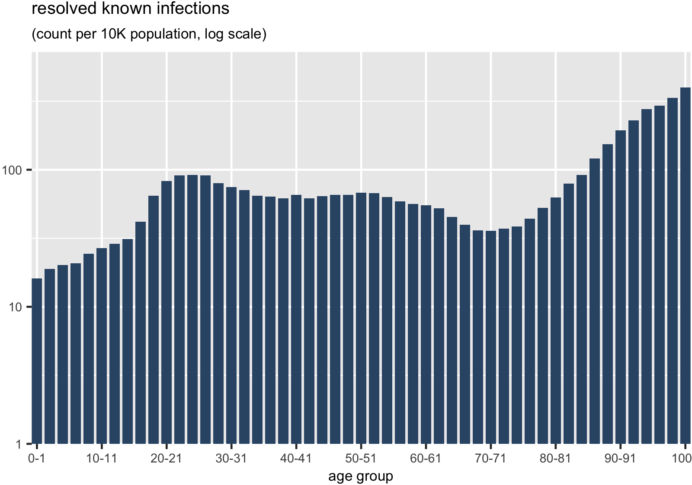
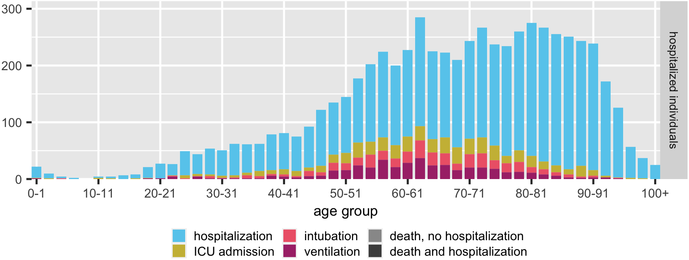
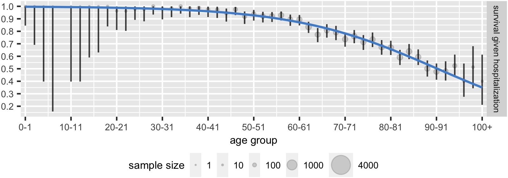

```{r setup, include=FALSE}
options(htmltools.dir.version = FALSE)

n_ccmp_resolved <- 86741
```

class: center, middle

<table style = "height: 250px; border: none;">
<tr>
<td>  </td>
<td>  </td>
</tr>
<tr>
<td> Michael Li </td>
<td> David Champredon </td>
</tr>
</table>
<br>
<table style = "height: 250px; border: none;">
<tr>
<td>  </td>
<td>  </td>
<td>  </td>
</tr>
<tr>
<td> Ben Bolker </td>
<td> Jonathan Dushoff </td>
<td> David Earn </td>
</tr>
</table>

---


class: center, middle

# who is getting sick?

# who is dying?

???

* basic questions in an epidemic/pandemic situation:
  * who is getting sick?
  * who is dying?
* COVID-19 is nasty: huge variance in outcomes, and it's not always clear why
  * one person's bad cold is another person's week-long ICU stay

---

background-image: url(figs/cbc-hosp-capacity.png)
background-position: center
background-size: 750px

???

* one of the biggest dangers with COVID is that we overwhelm our healthcare capacity

---

# who suffers?

--

* COVID-19 patients

--

* non-COVID-19 patients

--

<center>

</center>

.footnote[source:  [**CIHI**](https://www.cihi.ca/en/hospital-stays-in-canada)]

---

# who suffers?

* COVID-19 patients

* non-COVID-19 patients

<center>

</center>

.footnote[source:  [**CIHI**](https://www.cihi.ca/en/hospital-stays-in-canada)]

???
* and other conditions that aren't maybe immediately urgent but can become urgent: 
  * infections, crohn's disease flare-ups, falls, chest pains, pancreatitis, gall stones, uncontrolled diabetes, small bowel obstruction, seizures, minor trauma, medical overdose
* treatments like chemotherapy, dialysis 
---

# who suffers?

* COVID-19 patients

* non-COVID-19 patients

* healthcare workers

???

* risk of massive burnout from overwork in nurses, personal care workers, doctors, hospital custodians
* bottom line: a *lot* more is at stake besides the outcomes of COVID-19 patients

---

class: center, middle

## who is getting sick?
## who is dying?

???

* so going back to the two questions people seem to be very interested in, i'd posit that we need to add a question in between:

---

class: center, middle

## who is getting sick?
## **who is getting _very_ sick?**
## who is dying?

---

class: center, middle

## **who is getting _very_ sick?**


???

* huge variance in outcomes due to heterogeneity in the population. why?

---

class: middle

## comorbidities

--

## socioeconomic status

--

## employment conditions

--

## race

--

##**age**

???

* some heterogeneties that have been linked to the variance in COVID severity include...
  - comorbidities (concurrent medical conditions that can exacerbate COVID; being immunocompromised, respiratory illness, cardiovascular illness)
  - socioeconomic status (esp as it relates to access to healthcare)
  - employment conditions (is this a person who works from home or works in a high-risk setting for contracting COVID? do they have access to regular PPE?)
  - race
  - **age**

???

* this last one is especially interesting because age is readily available in the data, as well as in clinical settings
* COVID-19 severity is thought to scale up with age, but can we quantify this more precisely?

---

class: center, middle

# **what is the relationship between age and COVID-19 outcomes?**

---

# setting

--

* Ontario data courtesy of **Public Health Ontario**

--

* 23 Jan 2020 - 18 Nov 2020

--

* _resolved_ known infections (N = `r format(n_ccmp_resolved, big.mark = ",")`)

--

* downstream outcomes
  * hospitalization
  * ICU admission
  * intubation
  * ventilation
  * death

???

* resolved = record marked as "resolved" or "fatal"
* so just as a reminder, here's what the epidemic has looked like in Ontario:

---

background-image: url(figs/ts.png)
background-position: center
background-size: 850px

???
* things really picked up in march, and then we went into shutdown
* after shutdown, we started a phased reopening, that seemed to be going well for a while
  * note: the phases here roughly indicate where the majority of the provincial population was at the time (reopening hasn't been uniform across the province)
* then around the beginning-middle of sept things started getting worse
  * tempting to blame school reopening, but those only reopened around 8 sept, when we were already seeing an increase in reported infections (which lag from actual infection by a week or two)
* so that's how things have been going over time, but i promised you ages!

---

background-image: url(figs/rKI_panel.png)
background-position: center
background-size: 850px

???
* here's the count of resolved known infections by age
* we see a big crest in ages 20-29 (sorry, on behalf of my age group), but there are also local maxima in the 50s and 90s
* we have this kind of M shape, and then another bump in very old people
* interesting pattern, but what explains it?

---

background-image: url(figs/pop_panel.png)
background-position: center
background-size: 850px

???
* for one, the population isn't uniformly spread among these age groups
* the distribution of ages across the provincial population has a bit of that M shape we just saw...
* so, if instead we normalize the known infection counts by the age-specific population, we get...

---

background-image: url(figs/rKI_per_cap_panel.png)
background-position: center
background-size: 850px

???

* this distribution of resolved known infections per 10,000 population
  * note: this is on a log scale
* still have a bit of a crest in the 20s
  * for comparison, resolved known infections per 10K pop are about 1.4x higher in ages 20-29 compared with ages 30-69
* the large number in very old ages is a combination of small population (denominator) and high testing intensity in LTC homes 

---

background-image: url(figs/testing_panel.png)
background-position: center
background-size: 850px

???
* this touches on another big point: it's not just about who's getting sick, it's about who's getting tested (and thus where we are detecting infection)
* note again: this is on a log scale, also normalized by population
  * the pink are positive tests, which is roughly equivalent to resolved known infections
  * the black are negative tests
* we see what i said about testing intensity in very old ages
* interestingly, while in adults, we see roughly an even proportion of tests turning up positive, in kids we have fewer posties than we might expect given the number of negatives
  * could be for a few reasons:
    * kids are maybe more likely to turn up with coronavirus symptoms for an unrelated reason (fever, cough, runny nose, etc)
    * kids might have a bit of cross-immunity with other coronaviruses given how frequently they get colds/how recently these immune system experiences occurred

---

class: center, middle

## who is getting sick?
#### (who is getting tested?)

???
* OK, so we've seen who is getting sick (or rather, who we are noticing is getting sick because of who is getting tested)

---

class: center, middle

## who is dying?

???

* what about who is dying?

---

background-image: url(figs/death_panel.png)
background-position: center
background-size: 850px

???
* as you might expect, the extremely elderly are the most vulnerable; they are the most likely to be frail and have other comorbidities that would make fighting off a SARS-CoV-2 infection more difficult
* note that deaths here are faceted by whether or not we also have a record of hospitalization for that person
  * about 56% of deaths, the majority, have occurred in known infections with no record of hospitalization
  * prop of deaths not hospitalized seems to increase with age
* so those are deaths, but remember

---

class: center, middle

## **who is getting _very_ sick?**

???

* we also want to know who is getting very sick, and requiring some form of hospitalized intervention (esp since we now see that we can't infer hospitalization from deaths)

---

background-image: url(figs/death_hosp_counts.png)
background-position: center
background-size: 850px

???

* here is the distribution of hospitalizations (and other hospital outcomes) alongside deaths
* (we use counts because that's what determines pressure on the hospital system)
* hospital outcomes are nested, and patients are tallied by their most severe outcome (ventilation is more severe than intubation, which is more severe than ICU admission, which is more severe than plain hospitalization)
  * because this is how the counts were tallied, you can see the outline of each distribution in this panel directly
  
* what we notice: the distribution of hospitalizations is *much* wider than that for deaths
  * the wide plateau in hospitalizations starts roughly around age 54 and goes to about age 90...
  * that's much wider than generally appreciated. people in their fifties are not what we usually think of as "old" or "seniors"
* that's the age-specific pressure on the healthcare system, but can we maybe say more about individual risk?

---

background-image: url(figs/hosp_surv_probs.png)
background-position: center
background-size: 850px

class: bottom;

--

<br>

&nbsp;&nbsp;generalized additive model:
$g(Y) = \beta_0 + \beta_1 f(X)$

--

<br><br><br><br><br><br><br><br><br><br><br><br><br> 

&nbsp;&nbsp;&nbsp;&nbsp;&nbsp;&nbsp;&nbsp;&nbsp;&nbsp;&nbsp;&nbsp;&nbsp;&nbsp;&nbsp;&nbsp;&nbsp;&nbsp;&nbsp;&nbsp;&nbsp;&nbsp;&nbsp;&nbsp;&nbsp;&nbsp;&nbsp;&nbsp;&nbsp;&nbsp; generalized linear model: $g(Y) = \beta_0 + \beta_1 X$

???
* here we estimated hospitalization probability given known infection and the survival probability given hospitalization for COVID-19 treatment.
  * (so the y-axis represents a probability)
  * 95% confidence intervals given by the vertical lines
  * point area is proportional to the sample size
* large uncertainty, esp for survival prob in young and very old is due to small sample sizes (thankfully for young, sadly for old)

* hosp probability peaks in the 80-81 age group at about 30% 
* surv probability (for adults) is near 100% until about age 40
  * declines sooner than people might think
  * ex: a hospitalized 54-55 has a 92% chance of surviving COVID-19, so roughly 2 in 25 hospitalized COVID-19 patients in this age group die---rounding to the nearest 10 that's 1 in 10
  
* keep in mind: this is in a situation where our hospitals and ICUs have not been overwhelmed (yet) --- in some sense, this is the best we can do right now (barring some innovation in treatment or massive and rapid investment in our hospitals)
  
* probability estimates from a binomial model, specifically a generalized linear model (link function is the log-odds, i.e. a logistic regression, resulting in a sigmoid curve), and a generalized additive model, where we allow for smooth functions of the predictor so we can capture more general behaviour than a simple monotonic sigmoid)

---

# in summary

* more spread than (perhaps) expected (by population) in **20-29 year olds** and **very elderly**

<div align="right">

</div>

---

# in summary

* the age distribution of **deaths** gives _limited insight_ on the pressure COVID-19 is putting on the healthcare system

<div align="right">

</div>

--

* there is a _broad_ age distribution of **hospitalizations**
  * potential pressure from middle-aged individuals _and_ seniors

<div align="right">

</div>

--

* if need for hospitalization cannot be met, deaths may expand toward **younger ages** 
  
???
* pressure, especially now that infections have been increasing for weeks

---

# in summary

* **very elderly** are _less likely to be hospitalized_ than would be expected given age-specific prevalence

<div align="right">

</div>

--

* probability of survival given hospitalization dips as early as **age 40**

<div align="right">
 
</div>

---

## caveats

--

* **known infections < true prevalence**

--

* **detection bias**
  * who is being told to get tested? _(testing guidelines)_
  * who is actually getting tested? _(availability, effort)_
  
--
  
* **shutdown + physical distancing effort** has not homogeneous over time

???
* when both the first waves and second waves have occurred, the testing guidelines have selected for sufficiently symptomatic individuals (we were doing untargetted asymptomatic testing in the summer but stopped to protect testing capacity as the second wave started)
* most of the data was collected during a period where we didn't have untargetted asymptomatic testing
* we know a non-trivial proportion of infections (20-40% est) are asymptomatic; we're not capturing as much mild illness

---

# future work

--

* look at age distributions **over time**

--

* what are the age-specific **long-term morbidities** of infection? 

--

* can we correct for the **bias** in active infection testing?

???

* how have changes in physical distancing/public health guidelines affected the age-specific distributions of severe COVID and deaths
* some evidence that serious long-term complications despite mild initial illness
* can we estimate the (age-specific) asymptomatic proportion and correct for underdetection due to guidelines requiring symptoms for testing

---

# thanks to...

* **Sarah Morrison**, for help with lit review

* Ontario COVID-19 **Modelling Table** and **Science Table**, for valuable discussions

* **Public Health Ontario**, for sharing the data via the Ontario Health Data Platform

* **Natural Sciences and Engineering Research Council of Canada**, the **Michael G. DeGroote Institute for Infectious Disease Research**, and the **Public Health Agency of Canada** for funding DE, BB, and JD

---

class: center, middle

# thanks for listening!

paper available on <a href="https://www.medrxiv.org/content/10.1101/2020.09.01.20186395v1">medRxiv</a>

## questions?

.footnote[slides created with [**xaringan**](https://github.com/yihui/xaringan)]
